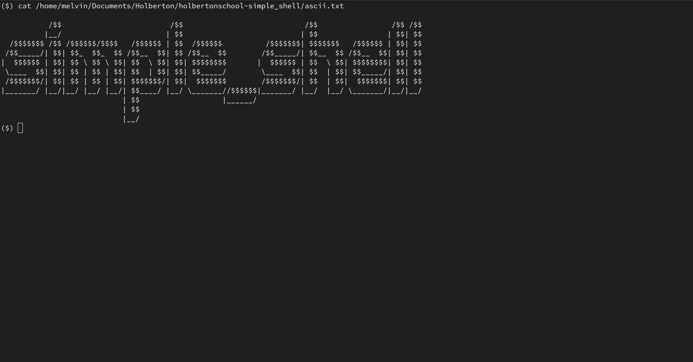
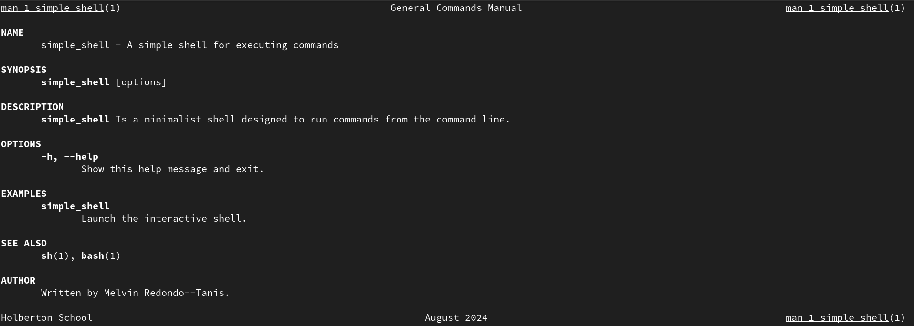

# holbertonschool-simple_shell


## Table of Contents
- [holbertonschool-simple\_shell](#holbertonschool-simple_shell)
	- [Table of Contents](#table-of-contents)
	- [Description](#description)
	- [Requirements](#requirements)
	- [Compilation](#compilation)
	- [Return](#return)
	- [Examples](#examples)
	- [Documentation](#documentation)
	- [Memory Leaks](#memory-leaks)
	- [Flowchart](#flowchart)
	- [Bugs](#bugs)
	- [Authors](#authors)

## Description
This project is a simple shell implementation for Holberton School. It serves as a UNIX command interpreter, replicating some functionalities of the simple shell `sh`. It allows users to execute commands, navigate directories, and handle input/output redirection. The shell supports both interactive and non-interactive modes, providing a convenient and efficient way to interact with the underlying operating system.

## Requirements
- All your files will be compiled on Ubuntu 20.04 LTS using `gcc`, using the options `-Wall -Werror -Wextra -pedantic -std=gnu89`
- Your code should use the `Betty` style. It will be checked using [betty-style.pl](https://github.com/hs-hq/Betty/blob/master/betty-style.pl "betty-style.pl") and [betty-doc.pl](https://github.com/hs-hq/Betty/blob/master/betty-doc.pl "betty-doc.pl")
- Global variables are not allowed
- No more than 5 functions per file

The following functions and system calls are allowed:
- all functions from string.h
- `access` (man 2 access)
- `chdir` (man 2 chdir)
- `close` (man 2 close)
- `closedir` (man 3 closedir)
- `execve` (man 2 execve)
- `exit` (man 3 exit)
- `_exit` (man 2 \_exit)
- `fflush` (man 3 fflush)
- `fork` (man 2 fork)
- `free` (man 3 free)
- `getcwd` (man 3 getcwd)
- `getline` (man 3 getline)
- `getpid` (man 2 getpid)
- `isatty` (man 3 isatty)
- `kill` (man 2 kill)
- `malloc` (man 3 malloc)
- `open` (man 2 open)
- `opendir` (man 3 opendir)
- `perror` (man 3 perror)
- `printf` (man 3 printf)
- `fprintf` (man 3 fprintf)
- `vfprintf` (man 3 vfprintf)
- `sprintf` (man 3 sprintf)
- `putchar` (man 3 putchar)
- `read` (man 2 read)
- `readdir` (man 3 readdir)
- `signal` (man 2 signal)
- `stat` (\_\_xstat) (man 2 stat)
- `lstat` (\_\_lxstat) (man 2 lstat)
- `fstat` (\_\_fxstat) (man 2 fstat)
- `strtok` (man 3 strtok)
- `wait` (man 2 wait)
- `waitpid` (man 2 waitpid)
- `wait3` (man 2 wait3)
- `wait4` (man 2 wait4)
- `write` (man 2 write)

## Compilation
Your shell will be compiled this way:
```
gcc -Wall -Werror -Wextra -pedantic *.c -o simple_shell
```

## Return
- The return value of the function is the status of the command executed
- In case of failure, the return value is -1
- In case of success, the return value is 0
- In case of exit, the return value is 2
- In case of Ctrl+D, the return value is 1
- In case of a command not found, the return value is 127
- In case of a permission denied, the return value is 126

## Examples
- Interactive mode:
```
$ ./simple_shell
($) /bin/ls
Desktop   Documents    Downloads    Music    Pictures    Public    Templates    Videos simple_shell
($)
($) exit
$
```
- Non-interactive mode:
```
$ echo "/bin/ls" | ./simple_shell
Desktop   Documents    Downloads    Music    Pictures    Public    Templates    Videos simple_shell
$ cat test_ls_2
/bin/ls
/bin/ls
$ cat test_ls_2 | ./simple_shell
Desktop   Documents    Downloads    Music    Pictures    Public    Templates    Videos simple_shell
Desktop   Documents    Downloads    Music    Pictures    Public    Templates    Videos simple_shell
```

## Documentation
To access the documentation for `simple_shell`, run the following command:
```bash
man ./man_1_simple_shell
```


## Memory Leaks
To check for memory leaks in `simple_shell`, run the following command:
```bash
valgrind --leak-check=full --show-leak-kinds=all ./simple_shell
```

## Flowchart
The following flowchart illustrates the process of the simple shell:
```ascii
                                        
         ┌────────────────────┐         
 ┌───────>       Start!       │         
 │       │                    │         
 │       └────────────────────┘         
 │                 │                    
 │          ┌──────∨───────┐            
 │    ┌─────┼    Main      ┼────┐       
 │    │     └──────────────┘    │       
 │ ┌──∨───────────┐   ┌─────────∨───┐   
 │ │              │   │             │   
 │ │ Non          │   │ Interactive │   
 │ │ Interactive  │   │             │   
 │ │              │   │             │   
 │ └──────────────┘   └─────────────┘   
 │  │      ┌────────────────┐    │      
 │  │      │  Interpreter   <────┘      
 │  │      └───────┼────────┘           
 │  └──────>───────∨────────┐           
 └─────────└─── Execute  ───┘           

```

## Bugs
- No known bugs at this time.

## Authors
- [Melvin Redondo--Tanis]("https://melvin.redondotanis.com")
